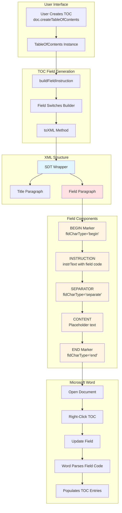

# TOC Field Implementation Guide

## Architecture Overview



## Field Structure Deep Dive

### 1. SDT Wrapper (Structured Document Tag)

```xml
<w:sdt>
  <w:sdtPr>
    <w:id w:val="-123456789"/>                    <!-- Unique SDT ID -->
    <w:docPartObj>
      <w:docPartGallery w:val="Table of Contents"/> <!-- Identifies as TOC -->
      <w:docPartUnique w:val="1"/>                 <!-- Prevents duplicates -->
    </w:docPartObj>
  </w:sdtPr>
  <w:sdtContent>
    <!-- TOC content goes here -->
  </w:sdtContent>
</w:sdt>
```

**Purpose**: Wraps TOC in a Structured Document Tag that Word recognizes as a special content control.

**Key Attributes**:

- `docPartGallery="Table of Contents"` - Tells Word this is a TOC
- `docPartUnique="1"` - Prevents creating duplicate TOCs via Insert menu

### 2. Title Paragraph (Optional)

```xml
<w:p>
  <w:pPr>
    <w:pStyle w:val="TOCHeading"/>  <!-- TOC heading style -->
  </w:pPr>
  <w:r>
    <w:t>Table of Contents</w:t>   <!-- Title text -->
  </w:r>
</w:p>
```

**Purpose**: Displays the TOC title above the entries.

**Style**: Uses built-in `TOCHeading` style (bold, larger font).

### 3. Field Paragraph (The Core)

#### Complete Structure

```xml
<w:p>
  <!-- PART 1: FIELD BEGIN -->
  <w:r>
    <w:fldChar w:fldCharType="begin"/>
  </w:r>

  <!-- PART 2: FIELD INSTRUCTION -->
  <w:r>
    <w:instrText xml:space="preserve">TOC \o "1-3" \h \* MERGEFORMAT</w:instrText>
  </w:r>

  <!-- PART 3: FIELD SEPARATOR -->
  <w:r>
    <w:fldChar w:fldCharType="separate"/>
  </w:r>

  <!-- PART 4: FIELD CONTENT (Placeholder) -->
  <w:r>
    <w:rPr>
      <w:noProof/>  <!-- Don't spell-check field results -->
    </w:rPr>
    <w:t>Right-click to update field.</w:t>
  </w:r>

  <!-- PART 5: FIELD END (CRITICAL!) -->
  <w:r>
    <w:fldChar w:fldCharType="end"/>
  </w:r>
</w:p>
```

#### Field Instruction Anatomy

```
TOC \o "1-3" \h \z \p "d" \* MERGEFORMAT
│   │  │     │  │  │  │   │
│   │  │     │  │  │  │   └─ Preserve formatting on update
│   │  │     │  │  │  └───── Tab leader: d=dot, h=hyphen, u=underscore, n=none
│   │  │     │  │  └──────── Hide page numbers in web layout
│   │  │     │  └─────────── Hide page numbers completely
│   │  │     └────────────── Use hyperlinks instead of page numbers
│   │  └──────────────────── Outline levels 1 through 3
│   └─────────────────────── Outline switch (heading levels)
└─────────────────────────── Field type: Table of Contents
```

#### Alternative: Custom Styles

```
TOC \t "MyHeading1,1," \t "MyHeading2,2," \h \* MERGEFORMAT
│   │  │               │  │                 │
│   │  │               │  │                 └─ Preserve formatting
│   │  │               │  └─────────────────── Use hyperlinks
│   │  │               └────────────────────── Include MyHeading2 at level 2
│   │  └────────────────────────────────────── Include MyHeading1 at level 1
│   └───────────────────────────────────────── Table switch (custom styles)
└───────────────────────────────────────────── Field type: TOC
```

## Implementation Patterns

### Pattern 1: Standard TOC Creation

```typescript
// Simple approach - uses defaults
const doc = Document.create();
doc.createTableOfContents(); // Default: levels 1-3, show page numbers

// Explicit approach - more control
const toc = TableOfContents.create({
  title: "Contents",
  levels: 3,
  showPageNumbers: true,
  useHyperlinks: true,
});
doc.addTableOfContents(toc);
```

**Generated Field Code**: `TOC \o "1-3" \h \* MERGEFORMAT`

### Pattern 2: Custom Styles TOC

```typescript
const toc = TableOfContents.create({
  includeStyles: [
    { styleName: "Heading1", level: 1 },
    { styleName: "Heading2", level: 2 },
    { styleName: "CustomSection", level: 1 },
  ],
  useHyperlinks: true,
});
doc.addTableOfContents(toc);
```

**Generated Field Code**: `TOC \t "Heading1,1," \t "Heading2,2," \t "CustomSection,1," \h \* MERGEFORMAT`

### Pattern 3: Web-Optimized TOC

```typescript
const toc = TableOfContents.createNoPageNumbers({
  title: "Navigation",
  levels: 3,
});
doc.addTableOfContents(toc);
```

**Generated Field Code**: `TOC \o "1-3" \h \n \z \* MERGEFORMAT`

- `\h` - Hyperlinks enabled
- `\n` - Hide page numbers
- `\z` - Hide in web layout

### Pattern 4: Loading and Preserving

```typescript
// Load existing document
const doc = await Document.load("existing.docx");

// TOC field instruction is preserved from original
// The originalFieldInstruction property stores: "TOC \o "1-4" \h \z \* MERGEFORMAT"

// When saving, the original instruction is used
await doc.save("preserved.docx");
// User can still right-click "Update Field" in Word!
```

## Proposed Helper Methods

### 1. Field Instruction Builder (Static Utility)

```typescript
/**
 * Location: src/elements/TableOfContents.ts
 */
public static buildCustomFieldInstruction(options: {
  levels?: { start: number; end: number };
  customStyles?: Array<{ name: string; level: number }>;
  switches?: {
    hyperlinks?: boolean;
    hidePageNumbers?: boolean;
    hideInWebLayout?: boolean;
    tabLeader?: 'dot' | 'hyphen' | 'underscore' | 'none';
  };
  customSwitches?: string;
  preserveFormatting?: boolean;
}): string;

// Usage:
const instruction = TableOfContents.buildCustomFieldInstruction({
  levels: { start: 1, end: 3 },
  switches: {
    hyperlinks: true,
    hideInWebLayout: true
  }
});
// Returns: "TOC \o "1-3" \h \z \* MERGEFORMAT"
```

### 2. Field Switch Setter (Instance Method)

```typescript
/**
 * Location: src/elements/TableOfContents.ts
 */
public setFieldSwitches(switches: {
  hyperlinks?: boolean;
  hidePageNumbers?: boolean;
  hideInWebLayout?: boolean;
  tabLeader?: 'dot' | 'hyphen' | 'underscore' | 'none';
}): this;

// Usage:
toc.setFieldSwitches({
  hyperlinks: true,
  hideInWebLayout: true,
  tabLeader: 'none'
});
```

### 3. Field Structure Validator

```typescript
/**
 * Location: src/elements/TableOfContents.ts
 */
public validateFieldStructure(): {
  valid: boolean;
  errors: string[];
  warnings: string[];
};

// Usage:
const validation = toc.validateFieldStructure();
if (!validation.valid) {
  console.error('Field errors:', validation.errors);
}
if (validation.warnings.length > 0) {
  console.warn('Field warnings:', validation.warnings);
}
```

### 4. Field Instruction Getter (✅ Already Exists!)

```typescript
/**
 * Location: src/elements/TableOfContents.ts (line 283)
 * Already implemented and working!
 */
public getFieldInstruction(): string;

// Usage:
const instruction = toc.getFieldInstruction();
console.log(instruction); // "TOC \o "1-3" \h \* MERGEFORMAT"
```

## Document-Level Helper Methods

### TOC Standardization Helper

**Location**: [`src/core/Document.ts`](src/core/Document.ts)

```typescript
/**
 * Standardizes all TOC field instructions to use consistent switches
 * Updates existing TOCs without recreating them
 *
 * @param options - Standard field switches to apply
 * @returns Number of TOCs updated
 *
 * @example
 * const doc = await Document.load('document.docx');
 * const count = doc.standardizeTOCFields({
 *   hyperlinks: true,
 *   hideInWebLayout: true,
 *   levels: { start: 1, end: 3 }
 * });
 * console.log(`Updated ${count} TOC(s)`);
 * await doc.save('standardized.docx');
 */
public standardizeTOCFields(options: {
  levels?: { start: number; end: number };
  hyperlinks?: boolean;
  hidePageNumbers?: boolean;
  hideInWebLayout?: boolean;
  tabLeader?: 'dot' | 'hyphen' | 'underscore' | 'none';
}): number {
  let count = 0;
  const tocElements = this.getTableOfContentsElements();

  for (const tocElement of tocElements) {
    const toc = tocElement.getTableOfContents();

    // Update levels if specified
    if (options.levels) {
      const levelRange = options.levels.end - options.levels.start + 1;
      toc.setLevels(levelRange);
    }

    // Update switches
    toc.setFieldSwitches({
      hyperlinks: options.hyperlinks,
      hidePageNumbers: options.hidePageNumbers,
      hideInWebLayout: options.hideInWebLayout,
      tabLeader: options.tabLeader
    });

    count++;
  }

  return count;
}
```

## Field Switch Reference

### Common Field Switches

| Switch | Parameter        | Purpose                   | Example                                           |
| ------ | ---------------- | ------------------------- | ------------------------------------------------- |
| `\o`   | `"start-end"`    | Outline levels (headings) | `\o "1-3"` includes Heading1-3                    |
| `\t`   | `"Style,Level,"` | Custom styles             | `\t "MyHeading,1,"` includes MyHeading at level 1 |
| `\h`   | None             | Use hyperlinks            | `\h` enables clickable entries                    |
| `\n`   | None             | Hide page numbers         | `\n` removes all page numbers                     |
| `\z`   | None             | Hide in web layout        | `\z` hides page numbers in web view               |
| `\p`   | `"char"`         | Tab leader character      | `\p "h"` uses hyphens                             |
| `\f`   | identifier       | Sequence identifier       | `\f TableSeq` for table sequences                 |
| `\l`   | identifier       | Entry identifier          | `\l "Paragraphs"` for specific entries            |
| `\*`   | `MERGEFORMAT`    | Preserve formatting       | Always include for stability                      |

### Advanced Switches (Less Common)

| Switch | Purpose                       | Example           |
| ------ | ----------------------------- | ----------------- |
| `\a`   | Add new entries               | `\a "Caption"`    |
| `\b`   | Bookmark range                | `\b MyBookmark`   |
| `\c`   | Sequence name                 | `\c "SEQ Figure"` |
| `\d`   | Separator character           | `\d "-"`          |
| `\s`   | Include sequence numbers      | `\s TableSeq`     |
| `\u`   | Use paragraphs styled for TOC | `\u`              |
| `\w`   | Preserve tabs                 | `\w`              |
| `\x`   | Preserve newlines             | `\x`              |

## Implementation Checklist

### ✅ Already Implemented

- [x] Complete field structure (begin → instruction → separate → content → end)
- [x] Field instruction builder with all common switches
- [x] Original field instruction preservation for loaded documents
- [x] SDT wrapper for Word integration
- [x] Public API: `getFieldInstruction()`
- [x] Validation: 5-element structure check in `toXML()`
- [x] Multiple factory methods for common TOC types

### 🔨 Needs Implementation

#### High Priority

- [ ] `validateFieldStructure()` - Comprehensive field validation
- [ ] `setFieldSwitches()` - Instance method to update switches
- [ ] `buildCustomFieldInstruction()` - Static builder utility
- [ ] Complete test coverage for field operations

#### Medium Priority

- [ ] Document-level `standardizeTOCFields()` helper
- [ ] Advanced field switch support (TC, RD fields)
- [ ] Field code parser (reverse of builder)

#### Low Priority

- [ ] Visual field editor helper methods
- [ ] Field switch presets (e.g., "web-optimized", "print-ready")

## Helper Method Locations

### TableOfContents Class (`src/elements/TableOfContents.ts`)

```typescript
class TableOfContents {
  // ✅ Existing Methods
  getFieldInstruction(): string;
  setLevels(levels: number): this;
  setShowPageNumbers(show: boolean): this;
  setUseHyperlinks(use: boolean): this;
  setHideInWebLayout(hide: boolean): this;

  // 🆕 Proposed Methods
  setFieldSwitches(switches: FieldSwitches): this;
  validateFieldStructure(): ValidationResult;
  static buildCustomFieldInstruction(options: CustomFieldOptions): string;
  parseFieldInstruction(instruction: string): ParsedField;
}
```

### Document Class (`src/core/Document.ts`)

```typescript
class Document {
  // ✅ Existing Methods
  createTableOfContents(title?: string): this;
  addTableOfContents(toc?: TableOfContents | TableOfContentsElement): this;
  getTableOfContentsElements(): TableOfContentsElement[];
  replaceTableOfContents(filePath: string): Promise<number>;

  // 🆕 Proposed Methods
  standardizeTOCFields(options: StandardizeOptions): number;
  validateAllTOCFields(): TOCValidationReport;
  refreshTOCEntries(): Promise<number>; // Pre-populate entries
}
```

## Critical Design Decisions

### ✅ Decision 1: Keep Field Structure Simple

**Status**: Implemented correctly

The current implementation correctly generates the minimal required field structure. This is the right approach because:

- Word handles TOC generation automatically
- Simpler structure = less room for errors
- Fully compliant with ECMA-376 standard

### ✅ Decision 2: Preserve Original Instructions

**Status**: Implemented via `originalFieldInstruction`

When loading documents, the original field instruction is preserved:

```typescript
// In constructor
this.originalFieldInstruction = properties.originalFieldInstruction;

// In toXML()
const fieldInstruction =
  this.originalFieldInstruction || this.buildFieldInstruction();
```

This ensures that manually edited field codes in Word are not lost.

### ✅ Decision 3: Always Include MERGEFORMAT

**Status**: Implemented in `buildFieldInstruction()`

The `\* MERGEFORMAT` switch is always appended:

```typescript
instruction += " \\* MERGEFORMAT";
```

This is critical for maintaining formatting when users update the field in Word.

## Common Field Patterns

### Pattern: Standard Document TOC

```
TOC \o "1-3" \* MERGEFORMAT
```

- Includes Heading1-3
- Shows page numbers
- Preserves formatting

### Pattern: Web Document TOC

```
TOC \o "1-3" \h \n \z \* MERGEFORMAT
```

- Includes Heading1-3
- Uses hyperlinks (`\h`)
- Hides page numbers (`\n`)
- Hides in web layout (`\z`)

### Pattern: Detailed Technical TOC

```
TOC \o "1-4" \h \p "d" \* MERGEFORMAT
```

- Includes Heading1-4
- Uses hyperlinks
- Dot tab leaders (`\p "d"`)

### Pattern: Custom Styles TOC

```
TOC \t "Chapter,1," \t "Section,2," \h \* MERGEFORMAT
```

- Includes "Chapter" style at level 1
- Includes "Section" style at level 2
- Uses hyperlinks

## Security Considerations

### 1. Field Instruction Injection Prevention

**Current Protection**: XML escaping in `instrText`

```typescript
{
  name: 'w:instrText',
  attributes: { 'xml:space': 'preserve' },
  children: [fieldInstruction]  // Automatically escaped by XMLBuilder
}
```

**Additional Recommendation**: Validate custom field switches

```typescript
public setFieldSwitches(switches: FieldSwitches): this {
  // Validate inputs before building instruction
  if (switches.customSwitches) {
    this.validateCustomSwitches(switches.customSwitches);
  }
  // ... rest of implementation
}

private validateCustomSwitches(switches: string): void {
  // Prevent injection attacks
  const dangerous = [';', '&', '|', '<', '>', '"'];
  for (const char of dangerous) {
    if (switches.includes(char)) {
      throw new Error(`Invalid character in custom switches: ${char}`);
    }
  }
}
```

### 2. Style Name Validation

When using `\t` switch with custom styles:

```typescript
// Validate style names
for (const style of this.includeStyles) {
  if (!/^[a-zA-Z0-9\s_-]+$/.test(style.styleName)) {
    throw new Error(`Invalid style name: ${style.styleName}`);
  }
}
```

## Performance Considerations

### Field Generation Performance

- **Current**: ✅ Efficient - O(1) for field instruction building
- **Impact**: Negligible - field instruction is a simple string concatenation

### Document Loading Performance

- **Current**: ✅ Efficient - Original instruction stored as-is
- **Impact**: Negligible - no parsing required during load

### Recommendation

No performance optimizations needed. Current implementation is already optimal.

## Backward Compatibility

### Preserving Existing Behavior

All new helper methods should:

1. ✅ Not break existing `toXML()` behavior
2. ✅ Preserve `originalFieldInstruction` from loaded documents
3. ✅ Maintain existing factory method signatures
4. ✅ Keep default values consistent

### API Stability

- New methods use **additive API changes** only
- No breaking changes to existing methods
- All new parameters are **optional**

## Testing Strategy

### Unit Tests

**File**: `src/__tests__/toc-field-structure.test.ts`

```typescript
describe("TOC Field Structure", () => {
  describe("Field Instruction Parsing", () => {
    it("should parse outline levels correctly");
    it("should parse custom styles correctly");
    it("should parse multiple switches correctly");
  });

  describe("Field Instruction Building", () => {
    it("should build standard instruction");
    it("should build instruction with hyperlinks");
    it("should build instruction with custom styles");
    it("should include MERGEFORMAT by default");
  });

  describe("Field Structure Validation", () => {
    it("should validate complete field structure");
    it("should detect missing field end");
    it("should detect invalid levels");
  });

  describe("Field Switch Manipulation", () => {
    it("should update switches correctly");
    it("should preserve other properties");
    it("should rebuild instruction after changes");
  });
});
```

### Integration Tests

**File**: `src/__tests__/toc-field-integration.test.ts`

```typescript
describe("TOC Field Integration", () => {
  it("should create updateable TOC in new document");
  it("should preserve field instruction when loading document");
  it("should maintain field structure after save/load cycle");
  it("should handle multiple TOCs in same document");
});
```

## Deployment Plan

### Phase 1: Core Helpers (Week 1)

1. Implement `validateFieldStructure()`
2. Implement `setFieldSwitches()`
3. Implement `buildCustomFieldInstruction()`
4. Unit tests for new methods

### Phase 2: Document Helpers (Week 2)

1. Implement `standardizeTOCFields()`
2. Integration tests
3. Documentation updates

### Phase 3: Examples & Polish (Week 3)

1. Create comprehensive examples
2. API documentation
3. User guide updates
4. Release notes

## Success Criteria

### Must Have ✅

- [x] TOC fields support "Update Field" in Word
- [x] Field structure is ECMA-376 compliant
- [x] Original field instructions preserved on load
- [ ] Comprehensive validation methods
- [ ] Complete API documentation
- [ ] Full test coverage (>80%)

### Should Have 📋

- [ ] Helper methods for common field switch patterns
- [ ] Document-level TOC standardization
- [ ] Field instruction builder utility

### Nice to Have 🎁

- [ ] Visual field editor helpers
- [ ] Advanced field switch presets
- [ ] Field code parser/analyzer

## Conclusion

**The current implementation already supports the core requirement**: TOC fields maintain their hidden field logic and can be updated in Word via right-click "Update Field".

The enhancement plan focuses on:

1. **Better developer experience** - Helper methods for easier field manipulation
2. **Validation tools** - Prevent field corruption
3. **Documentation** - Clear guidance on field structure and usage
4. **Testing** - Comprehensive coverage to ensure reliability

All enhancements are **additive** and maintain **100% backward compatibility** with existing code.
