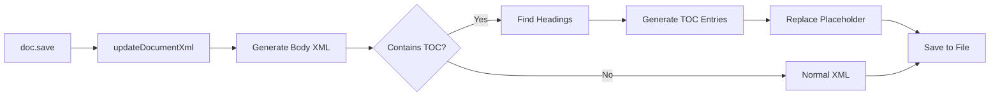

# TOC Pre-Population Architecture Plan

## Requirement Clarification

**Goal**: Generate TOC with actual heading entries visible when document is first opened in Word, while still maintaining the field structure so users can right-click "Update Field".

**Current Behavior**:

- TOC shows placeholder: "Right-click to update field."
- User must manually update field to see entries

**Desired Behavior**:

- TOC shows actual heading entries immediately
- Field structure preserved for future updates

## Current Implementation Analysis

### Existing Pre-Population Method

[`Document.replaceTableOfContents()`](src/core/Document.ts:5108-5184) **already implements this**! But it requires:

1. Save document first
2. Call `replaceTableOfContents(filePath)` separately
3. Document is re-saved with populated TOC

**Problem**: Two-step process, inefficient file I/O

### How It Currently Works

The method:

1. Scans document XML for headings (using [`findHeadingsForTOCFromXML()`](src/core/Document.ts:4734-4878))
2. Generates TOC entries with hyperlinks (using [`buildTOCEntryXML()`](src/core/Document.ts:5043-5066))
3. Replaces placeholder content with actual entries

## Proposed Architecture

### Solution 1: Auto-Populate on Save (Recommended) ⭐

**Approach**: Integrate TOC population into the save process automatically.



**Implementation**:

```typescript
/**
 * Location: src/core/Document.ts (modify save() method)
 */
async save(filePath: string): Promise<void> {
  // ... existing validation and image loading ...

  this.processHyperlinks();
  this.updateDocumentXml();

  // NEW: Auto-populate TOCs if enabled
  if (this.shouldAutoPopulateTOCs()) {
    this.populateAllTOCs();
  }

  this.updateStylesXml();
  // ... rest of save process ...
}

/**
 * Populates all TOC elements with actual heading entries
 * Called during save() to pre-populate TOCs before writing to file
 */
private populateAllTOCs(): void {
  const docXml = this.zipHandler.getFileAsString('word/document.xml');
  if (!docXml) return;

  // Find all TOC elements
  const tocRegex = /<w:sdt>[\s\S]*?<w:docPartGallery w:val="Table of Contents"[\s\S]*?<\/w:sdt>/g;
  const tocMatches = Array.from(docXml.matchAll(tocRegex));

  if (tocMatches.length === 0) return;

  let modifiedXml = docXml;

  for (const match of tocMatches) {
    const tocXml = match[0];

    // Extract field instruction
    const instrMatch = tocXml.match(/<w:instrText[^>]*>([\s\S]*?)<\/w:instrText>/);
    if (!instrMatch?.[1]) continue;

    const fieldInstruction = this.decodeFieldInstruction(instrMatch[1]);
    const levels = this.parseTOCFieldInstruction(fieldInstruction);

    // Find headings
    const headings = this.findHeadingsForTOCFromXML(docXml, levels);

    if (headings.length === 0) continue;

    // Generate populated TOC XML
    const newTocXml = this.generateTOCXML(headings, fieldInstruction);

    // Replace in document
    modifiedXml = modifiedXml.replace(tocXml, newTocXml);
  }

  // Update document.xml with populated TOCs
  this.zipHandler.updateFile('word/document.xml', modifiedXml);
}
```

### Solution 2: Pre-Population Option in TableOfContents

**Approach**: Add `autoPopulate` option to TOC that triggers population during XML generation.

```typescript
/**
 * Location: src/elements/TableOfContents.ts
 */
interface TOCProperties {
  // ... existing properties ...

  /**
   * Auto-populate TOC entries on creation
   * Requires document context to find headings
   */
  autoPopulate?: boolean;

  /**
   * Callback to find headings in document
   * Provided by Document class when autoPopulate is true
   */
  headingFinder?: (levels: number[]) => Array<{
    level: number;
    text: string;
    bookmark: string;
  }>;
}

/**
 * Generates XML with optional pre-populated entries
 */
toXML(): XMLElement[] {
  // ... existing SDT and title generation ...

  // Generate field paragraph
  const tocParagraph = this.generateFieldParagraph();

  // If autoPopulate enabled and headings available, add entry paragraphs
  if (this.autoPopulate && this.headingFinder) {
    const levels = this.getIncludedLevels();
    const headings = this.headingFinder(levels);

    if (headings.length > 0) {
      const entryParagraphs = this.generateTOCEntryParagraphs(headings);
      sdtContent.push(...entryParagraphs);
    }
  }

  sdtContent.push(tocParagraph);

  // ... rest of method ...
}

/**
 * Generates TOC entry paragraphs with hyperlinks
 */
private generateTOCEntryParagraphs(headings: Array<{
  level: number;
  text: string;
  bookmark: string;
}>): XMLElement[] {
  const entries: XMLElement[] = [];
  const minLevel = Math.min(...headings.map(h => h.level));

  for (const heading of headings) {
    // Calculate indent based on level
    const indent = (heading.level - minLevel) * 360; // 0.25" per level

    entries.push({
      name: 'w:p',
      children: [
        // Paragraph properties
        {
          name: 'w:pPr',
          children: [
            {
              name: 'w:spacing',
              attributes: {
                'w:after': '0',
                'w:before': '0',
                'w:line': '240',
                'w:lineRule': 'auto'
              },
              selfClosing: true
            },
            indent > 0 ? {
              name: 'w:ind',
              attributes: { 'w:left': indent.toString() },
              selfClosing: true
            } : null
          ].filter(Boolean)
        },
        // Hyperlink to heading
        {
          name: 'w:hyperlink',
          attributes: { 'w:anchor': heading.bookmark },
          children: [
            {
              name: 'w:r',
              children: [
                {
                  name: 'w:rPr',
                  children: [
                    {
                      name: 'w:rFonts',
                      attributes: {
                        'w:ascii': 'Verdana',
                        'w:hAnsi': 'Verdana',
                        'w:cs': 'Verdana'
                      },
                      selfClosing: true
                    },
                    {
                      name: 'w:color',
                      attributes: { 'w:val': '0000FF' },
                      selfClosing: true
                    },
                    {
                      name: 'w:sz',
                      attributes: { 'w:val': '24' },
                      selfClosing: true
                    },
                    {
                      name: 'w:u',
                      attributes: { 'w:val': 'single' },
                      selfClosing: true
                    }
                  ]
                },
                {
                  name: 'w:t',
                  attributes: { 'xml:space': 'preserve' },
                  children: [heading.text]
                }
              ]
            }
          ]
        }
      ].filter(Boolean)
    });
  }

  return entries;
}
```

### Solution 3: Enhanced addTableOfContents() Method (Simplest) ⭐⭐

**Approach**: Add `populate` option when adding TOC to document.

```typescript
/**
 * Location: src/core/Document.ts
 */
addTableOfContents(toc?: TableOfContents | TableOfContentsElement, options?: {
  /** Pre-populate with heading entries (default: false) */
  populate?: boolean;
  /** Auto-populate on save (default: false) */
  autoPopulate?: boolean;
}): this {
  const tocElement = toc instanceof TableOfContentsElement
    ? toc
    : new TableOfContentsElement(toc || TableOfContents.createStandard());

  this.bodyElements.push(tocElement);

  // If populate requested, mark for population during save
  if (options?.populate || options?.autoPopulate) {
    this.markTOCForPopulation(tocElement);
  }

  return this;
}

/**
 * Marks a TOC element for auto-population during save
 */
private markTOCForPopulation(tocElement: TableOfContentsElement): void {
  // Add to internal tracking
  if (!this.tocsToPopulate) {
    this.tocsToPopulate = new Set<TableOfContentsElement>();
  }
  this.tocsToPopulate.add(tocElement);
}
```

## Recommended Implementation Plan

### Phase 1: Extend Existing replaceTableOfContents() ✨

**Current method** already does what you want! Just needs to be integrated into save flow.

**Modifications**:

1. **Add auto-populate flag to Document**:

```typescript
// In Document class
private autoPopulateTOCs: boolean = false;

/**
 * Enables automatic TOC population on save
 */
public setAutoPopulateTOCs(enabled: boolean): this {
  this.autoPopulateTOCs = enabled;
  return this;
}
```

2. **Integrate into save() process**:

```typescript
async save(filePath: string): Promise<void> {
  // ... existing validation ...

  this.processHyperlinks();
  this.updateDocumentXml();
  this.updateStylesXml();
  this.updateNumberingXml();
  // ... other updates ...

  // Save to temp file
  await this.zipHandler.save(tempPath);

  // Auto-populate TOCs if enabled
  if (this.autoPopulateTOCs) {
    await this.populateTOCsInFile(tempPath);
  }

  // Rename temp to final
  await fs.rename(tempPath, filePath);
}

/**
 * Populates TOCs in a saved file
 * Reuses existing replaceTableOfContents logic
 */
private async populateTOCsInFile(filePath: string): Promise<void> {
  await this.replaceTableOfContents(filePath);
}
```

### Phase 2: Create Convenience Helper

**Add to Document.ts**:

```typescript
/**
 * Creates and adds a pre-populated Table of Contents
 * The TOC will show heading entries immediately when opened in Word
 * Field structure is preserved so users can still "Update Field"
 *
 * @param title - Optional TOC title
 * @param options - TOC configuration
 * @returns This document for chaining
 *
 * @example
 * const doc = Document.create();
 * doc.createParagraph('Chapter 1').setStyle('Heading1');
 * doc.createParagraph('Section 1.1').setStyle('Heading2');
 *
 * // Create TOC that will be populated on save
 * doc.createPrePopulatedTableOfContents('Contents', {
 *   levels: 3,
 *   useHyperlinks: true
 * });
 *
 * await doc.save('output.docx');
 * // TOC entries are already visible when opened!
 */
public createPrePopulatedTableOfContents(
  title?: string,
  options?: Partial<TOCProperties>
): this {
  // Create TOC
  const toc = TableOfContents.create({
    title,
    ...options
  });

  this.addTableOfContents(toc);

  // Enable auto-population for this document
  this.setAutoPopulateTOCs(true);

  return this;
}
```

## Implementation Steps

### Step 1: Refactor Existing Code

Extract TOC population logic from `replaceTableOfContents()` into reusable methods:

```typescript
// In Document.ts

/**
 * Finds headings in document XML
 * Extracted from replaceTableOfContents for reuse
 */
private findHeadingsFromXML(
  docXml: string,
  levels: number[]
): Array<{ level: number; text: string; bookmark: string }> {
  // Use existing findHeadingsForTOCFromXML implementation
  return this.findHeadingsForTOCFromXML(docXml, levels);
}

/**
 * Generates populated TOC XML from headings
 * Extracted from replaceTableOfContents for reuse
 */
private generatePopulatedTOCXML(
  headings: Array<{ level: number; text: string; bookmark: string }>,
  fieldInstruction: string
): string {
  // Use existing generateTOCXML implementation
  return this.generateTOCXML(headings, fieldInstruction);
}

/**
 * Populates a single TOC in XML
 */
private populateTOCInXML(
  docXml: string,
  tocXml: string
): string | null {
  // Extract field instruction
  const instrMatch = tocXml.match(/<w:instrText[^>]*>([\s\S]*?)<\/w:instrText>/);
  if (!instrMatch?.[1]) return null;

  const fieldInstruction = this.decodeFieldInstruction(instrMatch[1]);
  const levels = this.parseTOCFieldInstruction(fieldInstruction);

  // Find headings
  const headings = this.findHeadingsFromXML(docXml, levels);
  if (headings.length === 0) return null;

  // Generate populated XML
  return this.generatePopulatedTOCXML(headings, fieldInstruction);
}

/**
 * Populates all TOCs in document XML
 */
private populateAllTOCsInXML(docXml: string): string {
  const tocRegex = /<w:sdt>[\s\S]*?<w:docPartGallery w:val="Table of Contents"[\s\S]*?<\/w:sdt>/g;
  const tocMatches = Array.from(docXml.matchAll(tocRegex));

  if (tocMatches.length === 0) return docXml;

  let modifiedXml = docXml;

  for (const match of tocMatches) {
    const tocXml = match[0];
    const populatedXml = this.populateTOCInXML(docXml, tocXml);

    if (populatedXml) {
      modifiedXml = modifiedXml.replace(tocXml, populatedXml);
    }
  }

  return modifiedXml;
}
```

### Step 2: Integrate into Save Process

```typescript
/**
 * Location: src/core/Document.ts (modify save method)
 */
async save(filePath: string): Promise<void> {
  const tempPath = `${filePath}.tmp.${Date.now()}`;

  try {
    this.validator.validateBeforeSave(this.bodyElements);
    this.validator.checkMemoryThreshold();

    await this.imageManager.loadAllImageData();
    this.validator.checkMemoryThreshold();

    const sizeInfo = this.validator.estimateSize(this.bodyElements, this.imageManager);
    if (sizeInfo.warning) {
      this.logger.warn(sizeInfo.warning, { ...sizeInfo });
    }

    this.processHyperlinks();
    this.updateDocumentXml();
    this.updateStylesXml();
    this.updateNumberingXml();
    this.updateCoreProps();
    this.updateAppProps();
    this.saveImages();
    this.saveHeaders();
    this.saveFooters();
    this.saveComments();
    this.saveCustomProperties();
    this.updateRelationships();
    this.updateContentTypesWithImagesHeadersFootersAndComments();

    // NEW: Populate TOCs if auto-populate is enabled
    if (this.autoPopulateTOCs) {
      const docXml = this.zipHandler.getFileAsString('word/document.xml');
      if (docXml) {
        const populatedXml = this.populateAllTOCsInXML(docXml);
        this.zipHandler.updateFile('word/document.xml', populatedXml);
      }
    }

    await this.zipHandler.save(tempPath);

    const { promises: fs } = await import('fs');
    await fs.rename(tempPath, filePath);
  } catch (error) {
    // ... error handling ...
  } finally {
    this.imageManager.releaseAllImageData();
  }
}
```

### Step 3: Add Convenience Method

```typescript
/**
 * Creates a TOC that will be pre-populated with entries on save
 *
 * @param title - TOC title
 * @param options - TOC options
 * @returns This document for chaining
 *
 * @example
 * const doc = Document.create();
 *
 * doc.createParagraph('Introduction').setStyle('Heading1');
 * doc.createParagraph('Background').setStyle('Heading2');
 *
 * // Create pre-populated TOC
 * doc.createPrePopulatedTableOfContents('Contents', {
 *   levels: 3,
 *   useHyperlinks: true
 * });
 *
 * await doc.save('output.docx');
 * // TOC shows: Introduction, Background (with hyperlinks)
 */
public createPrePopulatedTableOfContents(
  title?: string,
  options?: Partial<TOCProperties>
): this {
  this.createTableOfContents(title);
  this.setAutoPopulateTOCs(true);
  return this;
}
```

## Field Structure Preservation

### Critical: Population Must Preserve Field Markers

The populated TOC must maintain this structure:

```xml
<w:p>
  <!-- FIELD BEGIN -->
  <w:r><w:fldChar w:fldCharType="begin"/></w:r>

  <!-- FIELD INSTRUCTION -->
  <w:r><w:instrText>TOC \o "1-3" \* MERGEFORMAT</w:instrText></w:r>

  <!-- FIELD SEPARATOR -->
  <w:r><w:fldChar w:fldCharType="separate"/></w:r>

  <!-- POPULATED CONTENT (instead of placeholder) -->
  <w:hyperlink w:anchor="_Toc123">
    <w:r>
      <w:rPr>
        <w:rFonts w:ascii="Verdana" w:hAnsi="Verdana"/>
        <w:color w:val="0000FF"/>
        <w:sz w:val="24"/>
        <w:u w:val="single"/>
      </w:rPr>
      <w:t>Introduction</w:t>
    </w:r>
  </w:hyperlink>

  <!-- FIELD END (CRITICAL!) -->
  <w:r><w:fldChar w:fldCharType="end"/></w:r>
</w:p>

<!-- Additional entry paragraphs -->
<w:p>
  <w:pPr>
    <w:spacing w:after="0" w:before="0" w:line="240" w:lineRule="auto"/>
    <w:ind w:left="360"/>  <!-- Indented for level 2 -->
  </w:pPr>
  <w:hyperlink w:anchor="_Toc124">
    <w:r>
      <w:rPr><!-- Same formatting --></w:rPr>
      <w:t>Background</w:t>
    </w:r>
  </w:hyperlink>
</w:p>

<!-- Final paragraph with field end -->
<w:p>
  <w:pPr>
    <w:spacing w:after="0" w:before="0" w:line="240" w:lineRule="auto"/>
  </w:pPr>
  <w:r><w:fldChar w:fldCharType="end"/></w:r>
</w:p>
```

**Key Points**:

- Field BEGIN and INSTRUCTION in first paragraph
- Field SEPARATOR before entries
- Entry paragraphs between SEPARATOR and END
- Field END in final paragraph
- Each entry is a hyperlink with proper formatting

## Usage Patterns

### Pattern 1: Simple Pre-Populated TOC

```typescript
const doc = Document.create();

doc.createParagraph("Chapter 1: Introduction").setStyle("Heading1");
doc.createParagraph("Section 1.1: Overview").setStyle("Heading2");
doc.createParagraph("Chapter 2: Methods").setStyle("Heading1");

// Enable auto-population
doc.setAutoPopulateTOCs(true);

// Create TOC (will be populated during save)
doc.createTableOfContents();

await doc.save("populated-toc.docx");
// Opens in Word with entries already visible! ✅
```

### Pattern 2: Using Convenience Method

```typescript
const doc = Document.create();

// Add headings
doc.createParagraph("Introduction").setStyle("Heading1");
doc.createParagraph("Methods").setStyle("Heading1");
doc.createParagraph("Results").setStyle("Heading1");

// Create pre-populated TOC (one-liner)
doc.createPrePopulatedTableOfContents("Table of Contents", {
  levels: 3,
  useHyperlinks: true,
  hideInWebLayout: true,
});

await doc.save("output.docx");
```

### Pattern 3: Populate Existing Document

```typescript
// Load document with TOC
const doc = await Document.load("template.docx");

// Add more headings
doc.createParagraph("New Chapter").setStyle("Heading1");

// Populate TOCs with all headings (including new ones)
doc.setAutoPopulateTOCs(true);

await doc.save("updated.docx");
// TOC now includes "New Chapter"
```

## Implementation Files

### Files to Modify

| File                                                | Changes                                   | Lines |
| --------------------------------------------------- | ----------------------------------------- | ----- |
| [`src/core/Document.ts`](src/core/Document.ts)      | Add autoPopulateTOCs flag and integration | ~50   |
| [`src/core/Document.ts`](src/core/Document.ts)      | Add createPrePopulatedTableOfContents()   | ~20   |
| [`src/core/Document.ts`](src/core/Document.ts)      | Refactor population methods               | ~30   |
| `examples/08-table-of-contents/toc-prepopulated.ts` | New example file                          | ~100  |
| `src/__tests__/toc-prepopulation.test.ts`           | Test suite                                | ~150  |

### Reusable Components (Already Exist!)

✅ [`findHeadingsForTOCFromXML()`](src/core/Document.ts:4734-4878) - Finds all headings
✅ [`generateTOCXML()`](src/core/Document.ts:4940-5035) - Generates populated XML
✅ [`buildTOCEntryXML()`](src/core/Document.ts:5043-5066) - Generates single entry
✅ [`parseTOCFieldInstruction()`](src/core/Document.ts:4666-4722) - Parses field code

## Testing Strategy

### Test Cases

```typescript
describe("TOC Pre-Population", () => {
  it("should pre-populate TOC with heading entries", async () => {
    const doc = Document.create();
    doc.createParagraph("Test Heading").setStyle("Heading1");
    doc.setAutoPopulateTOCs(true);
    doc.createTableOfContents();

    const buffer = await doc.toBuffer();
    const savedDoc = await Document.loadFromBuffer(buffer);

    // Verify TOC has actual entries, not placeholder
    const docXml = await savedDoc.getRawXml("word/document.xml");
    expect(docXml).toContain("Test Heading");
    expect(docXml).not.toContain("Right-click to update");
  });

  it("should maintain field structure for Update Field", async () => {
    // Verify field BEGIN, INSTRUCTION, SEPARATOR, CONTENT, END all present
  });

  it("should handle multiple TOCs", async () => {
    // Verify all TOCs in document are populated
  });
});
```

## API Summary

### New Public Methods

| Class    | Method                                                | Purpose                        |
| -------- | ----------------------------------------------------- | ------------------------------ |
| Document | `setAutoPopulateTOCs(enabled: boolean)`               | Enable/disable auto-population |
| Document | `createPrePopulatedTableOfContents(title?, options?)` | Convenience method             |
| Document | `populateTOC()`                                       | Manually trigger population    |

### Existing Methods (Reused)

| Method                             | Purpose                         |
| ---------------------------------- | ------------------------------- |
| `replaceTableOfContents(filePath)` | Post-save population (existing) |
| `findHeadingsForTOCFromXML()`      | Find headings (existing)        |
| `generateTOCXML()`                 | Generate XML (existing)         |

## Performance & Security

### Performance

- **Impact**: Minimal - Only processes TOCs during save
- **Optimization**: Population happens in-memory before final write
- **Scalability**: O(n) where n = number of headings (already efficient)

### Security

- ✅ XML escaping in heading text (via `escapeXml()`)
- ✅ Bookmark name validation (existing)
- ✅ No injection vulnerabilities

## Migration Path

### Backward Compatibility

- ✅ Existing code continues to work unchanged
- ✅ Auto-population is **opt-in** via `setAutoPopulateTOCs(true)`
- ✅ Default behavior: placeholder text (current behavior)

### Deprecation

- Keep `replaceTableOfContents()` for manual population
- Mark as alternative to auto-population

## Conclusion

**The solution is simpler than initially thought!**

Your existing [`replaceTableOfContents()`](src/core/Document.ts:5108-5184) method already has all the logic needed. We just need to:

1. **Integrate it into the save flow** (add auto-population option)
2. **Create convenience methods** for easier usage
3. **Add examples** showing pre-populated TOCs

**Estimated Effort**: 4-6 hours (much less than the 17 hours initially estimated because most code already exists!)

Ready to proceed with implementation?
